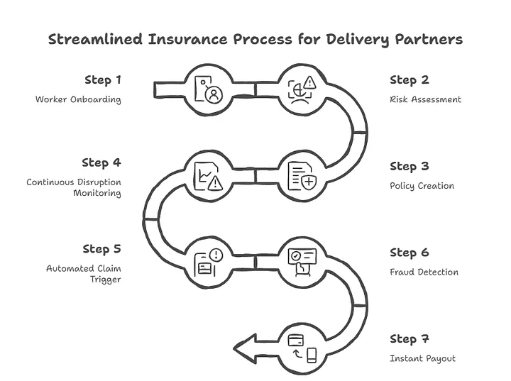
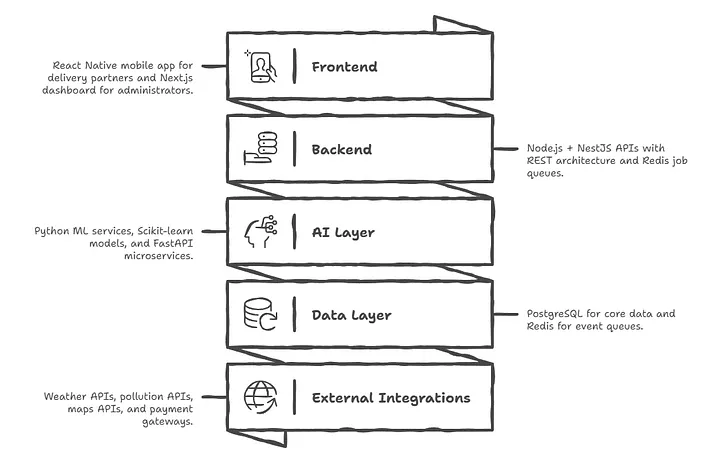

# GigZo            

### AI-Powered Parametric Insurance for Gig Delivery Workers

## Overview

GigZo is an AI-powered parametric insurance platform designed to protect delivery partners from income loss caused by real-world disruptions such as heavy rain, extreme pollution, floods, and sudden curfews.

Gig workers depend on daily working hours to earn their income. When external disruptions occur, deliveries stop and earnings immediately drop. GigZo introduces an automated safety net where verified external events trigger instant compensation without requiring manual claims.

The platform monitors environmental and social disruption signals using external APIs and AI models. When a predefined threshold is crossed, the system automatically initiates a claim and processes a payout for affected workers.

Our goal is simple:
**protect the earnings of workers whose livelihoods depend on unpredictable real-world conditions.**

---


# Problem Statement

India’s gig economy includes millions of delivery partners working for platforms such as food delivery, e-commerce logistics, and quick commerce services. These workers face income volatility because their earnings depend heavily on factors outside their control.

Examples of disruptions:

* Heavy rain or flooding preventing outdoor movement
* Severe air pollution limiting outdoor work
* Extreme heat waves
* Suddens curfews or zone restrictions
* Citywide disruptions affecting delivery demand

When these events occur, workers lose valuable working hours and daily income. Traditional insurance systems are slow, paperwork heavy, and unsuitable for small, short-term income losses.

GigZo solves this by using **parametric insurance**, where payouts are automatically triggered when measurable external events exceed predefined thresholds.

---

# What is Parametric Insurance

Parametric insurance provides automatic payouts when a predefined measurable condition is met.

Example:

| Event         | Trigger               | Payout |
| ------------- | --------------------- | ------ |
| Heavy Rain    | Rainfall > 50mm       | ₹500   |
| Air Pollution | AQI > 400             | ₹300   |
| Flood Alert   | Water level threshold | ₹800   |

Instead of filing claims manually, external data sources verify the event and the system triggers compensation automatically.

---

# Target Persona

Our solution focuses on **Food Delivery Partners** working on platforms such as:

* Zomato
* Swiggy

These workers typically earn income on a daily or weekly basis and depend on consistent working hours.

Key characteristics:

* Income linked to completed deliveries
* Work performed outdoors
* High exposure to environmental disruptions
* Limited financial protection

GigZo provides a weekly insurance model aligned with their earning cycle.

---

# Key Features

## AI Risk Assessment

Machine learning models calculate dynamic weekly insurance premiums based on environmental and location-based risks.

Risk factors include:

* Historical rainfall data
* Flood risk zones
* Air pollution trends
* City infrastructure data
* Worker operating zones

The model outputs a risk score used to determine premium pricing.

---

## Dynamic Weekly Premium Model

Premiums adjust automatically based on risk score.

Example:

| Worker Zone | Risk Score | Weekly Premium |
| ----------- | ---------- | -------------- |
| Sector 17   | Medium     | ₹45            |
| Sector 35   | High       | ₹60            |

Workers can select coverage plans based on their preferences.

---

## Automated Parametric Claims

The system continuously monitors external APIs.

When conditions cross a defined threshold, the system automatically:

1. detects the disruption
2. verifies affected worker zones
3. triggers claims
4. initiates payouts

This eliminates manual claim submission.

---

## Fraud Detection

To prevent abuse, the platform uses AI-driven fraud detection mechanisms.

Detection methods include:

* GPS location validation
* anomaly detection in claim patterns
* duplicate claim checks
* verification of disruption data sources

Suspicious claims are flagged for admin review.

---

## Instant Payout Simulation

The platform integrates payment APIs to simulate instant payouts to workers once claims are approved.

Example payout flow:
Disruption detected → Claim created → Fraud check → Instant payout triggered.

---

# System Architecture

```
Worker Mobile App (React Native)
        │
        ▼
Backend API Gateway (Node.js / NestJS)
        │
------------------------------------------------
| Core Services                                |
|-----------------------------------------------|
| Authentication Service                       |
| Worker Profile Service                       |
| Policy Management Service                    |
| Claims Management Service                    |
| Payment Service                              |
------------------------------------------------
        │
        ▼
Event Trigger Engine
(Weather / Pollution Monitoring)

        │
        ▼
AI/ML Services
Risk Scoring + Fraud Detection

        │
        ▼
Database Layer
PostgreSQL + Redis

        │
        ▼
Admin Dashboard
(Analytics & Monitoring)
```

---

# End-to-End Workflow

The GigZo platform operates through a fully automated parametric insurance pipeline.



### Step 1 — Worker Registration

Workers register through the mobile app and provide:

* name
* phone number
* delivery platform
* operating location
* delivery zone

The backend stores worker profiles and assigns a risk zone.

---

### Step 2 — Risk Assessment

AI models analyze environmental data and assign a risk score to the worker's operating zone.

---

### Step 3 — Premium Generation

Weekly insurance premiums are dynamically calculated using the risk score.

Workers select a coverage plan and activate their policy.

---

### Step 4 — Disruption Monitoring

The event trigger engine continuously monitors external data sources such as weather and air quality APIs.

---

### Step 5 — Claim Trigger

When a disruption threshold is crossed, the system automatically generates claims for affected workers.

---

### Step 6 — Fraud Verification

AI models verify:

* worker location
* disruption authenticity
* claim patterns

Valid claims proceed to payout.

---

### Step 7 — Instant Payout

The system triggers a payout using payment gateway integrations and notifies the worker.

---

# Technology Stack



## Frontend

* React Native (Expo)
* Expo Router
* React Native Paper
* Zustand
* Axios

## Backend

* Node.js
* NestJS
* REST APIs

## AI / Machine Learning

* Python
* FastAPI
* Scikit-learn
* XGBoost
* Isolation Forest

## Databases

* PostgreSQL
* Redis

## External APIs

* OpenWeatherMap
* Air Quality APIs
* Map APIs
* Razorpay Sandbox

---

# Repository Structure

```
GigZo
│
├ mobile-app
│   ├ app
│   ├ components
│   ├ services
│   └ package.json
│
├ backend
│   ├ src
│   ├ controllers
│   ├ services
│   └ package.json
│
├ ai-services
│
├ docs
│
└ README.md
```
---

# Adversarial Defense & Anti-Spoofing Strategy

## Overview

GigZo is designed under the assumption that adversaries will actively attempt to exploit the system using techniques such as GPS spoofing, coordinated fraud rings, and synthetic activity simulation.

Recent threat scenarios demonstrate that relying solely on GPS-based validation is insufficient and can lead to large-scale financial losses due to coordinated attacks .

To address this, GigZo implements a **multi-layered fraud detection architecture** that evaluates the consistency of multiple independent signals. Instead of trusting a single data source, the system builds a **composite trust score** using device, network, behavioral, and environmental data.

---

## 1. Differentiation: Genuine Worker vs Spoofed Actor

### Definition

The system differentiates between legitimate and fraudulent claims by analyzing **cross-signal consistency** rather than relying on GPS location alone.

### Core Principle

A genuine worker produces consistent signals across movement, device state, and environmental context, whereas a spoofed actor introduces detectable inconsistencies across these dimensions.

### Detection Mechanisms

#### Multi-Signal Location Verification

GPS data is validated against:

* IP-based geolocation
* Cell tower triangulation
* Nearby WiFi signatures

Any mismatch between these signals (e.g., GPS indicating a flood zone while network signals indicate a residential location) is flagged as suspicious.

---

#### Motion and Sensor Validation

Device sensor data is used to verify physical movement:

* Accelerometer and gyroscope detect real-world motion patterns
* Unrealistic transitions (e.g., long-distance jumps without corresponding motion) are flagged

This prevents “static spoofing” where users simulate location changes without actual movement.

---

#### Device Integrity Checks

The system evaluates device-level trustworthiness by detecting:

* Mock location settings
* Rooted or jailbroken devices
* Emulator-based environments

Devices with compromised integrity are assigned lower trust scores and subjected to stricter validation.

---

#### Behavioral Intelligence (ML Layer)

Machine learning models analyze:

* Claim frequency
* Timing patterns
* Historical user behavior

Anomaly detection models (e.g., Isolation Forest) identify deviations from normal usage patterns, such as repeated high-frequency claims during disruption windows.

---

#### Fraud Ring Detection (Graph-Based Analysis)

The system identifies coordinated attacks by analyzing relationships across users:

* Simultaneous claim spikes within the same region
* Shared IP ranges or device patterns
* Similar behavioral timelines

Clustered anomalies are treated as potential organized fraud rings and escalated for deeper validation.

---

## 2. Data Signals Beyond GPS

To ensure robust fraud detection, GigZo incorporates multiple data sources:

### Network Signals

* IP address and geolocation
* VPN or proxy usage detection
* Cell tower identifiers

---

### Device and Environmental Signals

* Nearby WiFi networks (location fingerprinting)
* Device OS integrity indicators
* Bluetooth signals (optional extension)

---

### Sensor Data

* Accelerometer (movement validation)
* Gyroscope (directional changes)
* Speed consistency checks

---

### Temporal and Behavioral Signals

* Claim timing distribution
* Frequency and repetition patterns
* Historical trust scores

---

### External Validation Data

* Weather APIs (rainfall, AQI thresholds)
* Government alerts (curfews, disasters)
* Traffic and disruption data

These ensure that both the **event is real** and the **user is genuinely affected**.

---

## 3. UX Balance: Protecting Honest Workers

### Problem

Strict fraud detection systems risk penalizing genuine users, especially in scenarios involving:

* Network instability during severe weather
* Temporary signal loss in low-connectivity zones

### Solution: Risk-Based Claim Handling

Claims are processed using a tiered approach:

| Risk Level  | Action            |
| ----------- | ----------------- |
| Low Risk    | Instant payout    |
| Medium Risk | Soft verification |
| High Risk   | Manual review     |

---

### Soft Verification Layer

Instead of blocking claims outright, the system may request lightweight verification:

* Re-attempted location validation
* Simple user confirmation
* Optional contextual proof

This minimizes friction for legitimate users while filtering out fraudulent activity.

---

### Grace Period Mechanism

Users are provided a time window to:

* Reconnect to the network
* Submit additional validation data

This accounts for genuine disruptions caused by poor connectivity during adverse conditions.

---

### Human-in-the-Loop Review

High-risk claims are escalated to an administrative review system:

* AI provides supporting signals and anomaly indicators
* Human reviewers make final decisions

This hybrid approach reduces false positives while maintaining system integrity.

---

### Partial Payout Strategy

In uncertain scenarios:

* A partial payout may be issued immediately
* Remaining amount is released after verification

This ensures that genuine users are not financially penalized due to system uncertainty.

---

## 4. Integrated Fraud Detection Pipeline

```
Event Trigger Engine
        ↓
Claim Generation
        ↓
Fraud Detection Engine (Multi-Signal Analysis)
        ↓
Risk Scoring
        ↓
Decision Engine
   ├── Instant Payout
   ├── Soft Verification
   └── Manual Review
```

---

## Key Insight

GigZo does not rely on a single source of truth such as GPS.
Instead, it evaluates the **consistency of multiple independent signals** to determine whether a claim reflects real-world conditions.

This approach enables the platform to:

* Detect sophisticated spoofing attempts
* Prevent coordinated fraud attacks
* Maintain liquidity pool stability
* Ensure fair and reliable payouts for genuine workers

---

---

# Development Setup

Clone the repository

```
git clone https://github.com/your-repo/GigZo
```

Install dependencies

```
cd mobile-app
npm install
```

Run mobile app

```
npm run android
```

Run backend

```
cd backend
npm install
npm run start
```

---

# Future Improvements

* Hyper-local risk prediction models
* Predictive disruption alerts
* Delivery platform integrations
* Risk heatmaps for insurers
* Gamified incentives for workers
* Expansion to other gig workers

---

# Team

Team Dive Into Infinity

* Dhruv Kumar Aggarwal
* Pratham Mittal
* Damanpreet Kaur
* Abhinavpreet Singh Arora

---

# Vision

GigZo aims to build a financial safety net for gig workers by combining artificial intelligence, real-time data, and parametric insurance models.

By automating protection against real-world disruptions, we aim to create a resilient and sustainable gig economy.
